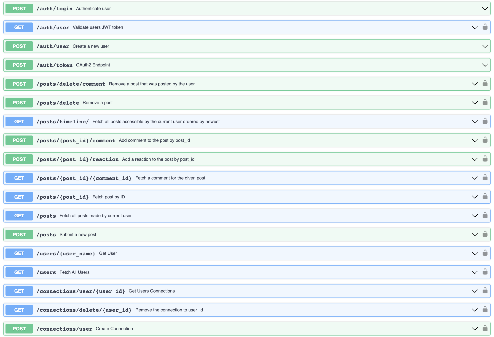

# Team J³

Team J³ decided to create a web application. The web application is internally named City Park. City Park will reflect a Twitter-like platform but lite in comparison. The application is configured with a docker compose file to strategically stand-up the application without the need of user interaction. The infrastructure is postured to be scaled with minimal refactoring for the likelihood where we need to spin up multiple data services to keep up with traffic demand.

## Development System Specifications

### Software:

#### System:
- docker v23.0.1
- docker compose v3.8
- npm v9.6.0
- node v19.7.0
- python v3.11

#### Front-end (JS):
- vue.js v3.2.47
- vuetify.js v3.1.11
- pinia v2.0.33
- axios v1.3.4
- vite v4.2.1
- nginx v1.23.3
    
#### Back-end (Python):

- anyio v3.6.2
- fastapi v0.95.0
- pydantic v1.10.6
- SQLAlchemy v2.0.7
- starlette v0.26.1
- uvicorn v0.21.1

 #### Database:
- postgresSQL v15.2

### Hardware (ESTIMATED):
-	CPU (4 Cores)
-	RAM (8 GB)

### Runtime System Specifications:
#### Software:
- docker v23.0.1

#### Hardware (ESTIMATED):
> Running out of a Linode VPS at this time
- CPU (4 Cores)
- RAM (8 GB)

Hardware specifications will be more accurate once the application is complete. Only then will we be able to accurately measure each container’s resource usage.

 

